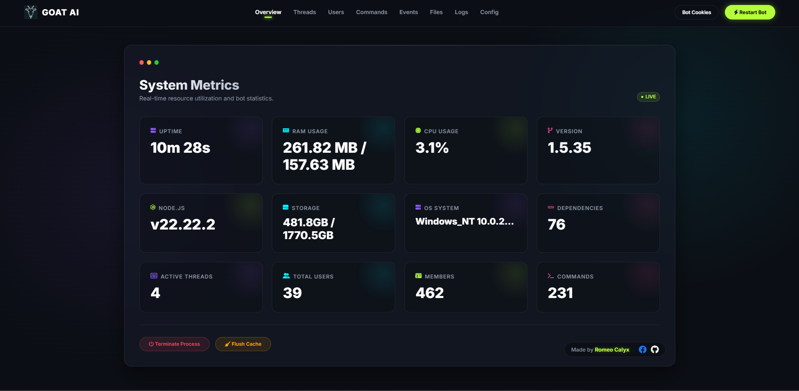
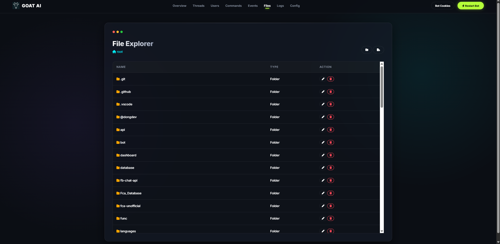
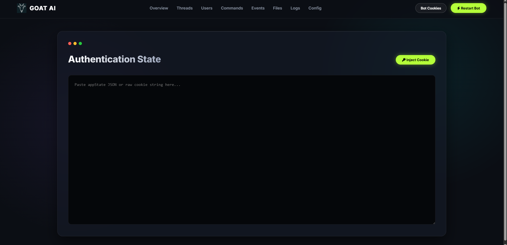
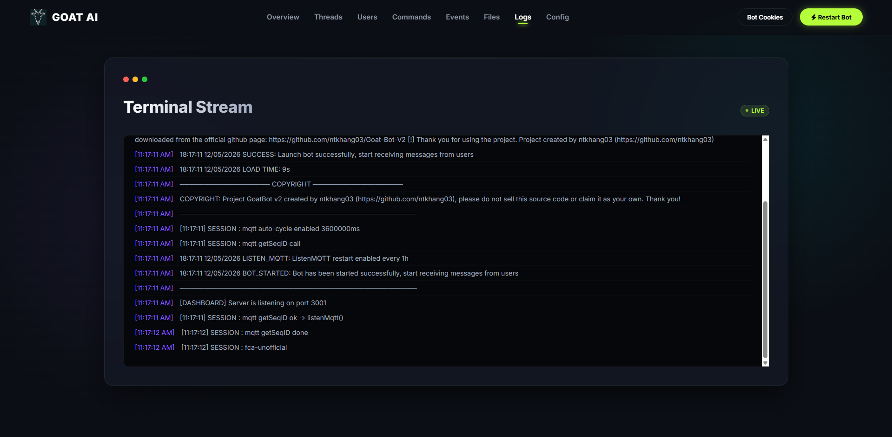

# 🐐 Goat-Bot Admin Dashboard

A premium, high-performance web-based administration panel for Goat-Bot. This dashboard provides a beautiful, responsive interface to manage your bot instance with real-time metrics, file management, and live logging.

## 📸 Screenshots

*Real-time System Metrics & Control Panel*

*Advanced File Management & Editor*

*Cookie Injection & Auth Management*

*Live Log Streaming*

## 🚀 Key Features

### 📊 Real-time System Metrics
Monitor your bot's health with a comprehensive suite of live-updating stats:
- **Performance**: Uptime, RAM Usage, CPU Time.
- **Bot Stats**: Active Threads, Total Users, Member counts.
- **System**: Node.js version, OS details, Storage status, and Dependency count.

### 🛠️ Command & Event Management
Take full control of your bot's functionality:
- **Module Registry**: View all loaded command and event modules.
- **Live Editing**: Modify command logic directly in the dashboard and apply changes without manual restarts.

### 📜 Live Terminal Stream
Stay informed with a real-time log capture system that hooks into the bot's standard output, allowing you to monitor activities and errors as they happen.

### ⚙️ Config & Auth Management
- **Config Editor**: Direct access to `config.json` for rapid adjustments.
- **Bot Cookies**: Inject `appState` JSON or cookie strings directly to manage bot authentication states.
- **Remote Controls**: Restart or Terminate the bot process with a single click.

---
*Created with ❤️ by Romeo Calyx*
